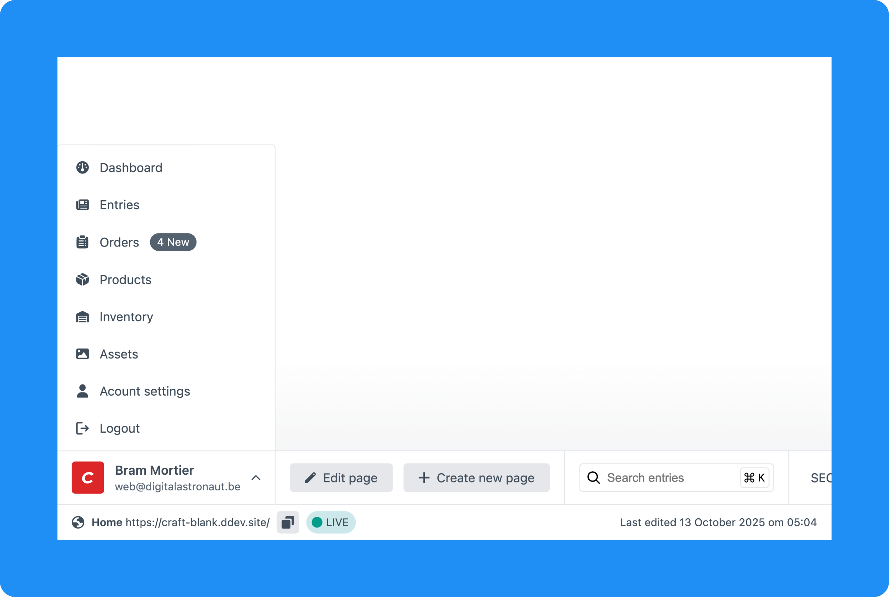

# Start menu

The first chunk of the toolbar is the start menu. It shows the current user, and if a volume is assigned for user profile images their profile image.

::: tip
If you have a volume assigned for user profile images and enabled it in the user settings this wil be shown instead of the craft CMS logo.
:::

## Customizing the start menu

By default the start menu contains the most commonly used links for both a setup with and without Craft Commerce. Your can customize what default links are shown in the list on the
`Author toolbar > Settings` page by editing the default start menu links options.

### Adding custom links

If your project makes use of a plugin or other custom feature that is used a lot by authors you can provide extra links in the custom links table.
