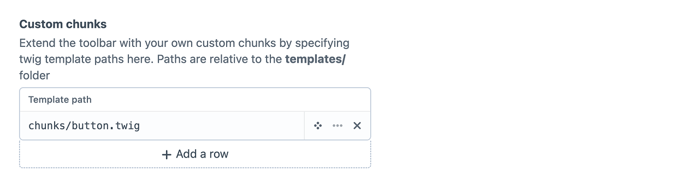

# Custom chunks

The plugin allows your to extend the toolbar with your own custom chunks by creating and adding twig templates to the custom chunks table on the `Author toolbar > Settings` page.



All default chunks in the toolbar are wrapped in the following div to ensure unity across widgets.

```twig
<div class="cat-toolbar-chunk">
    <!-- Widget code -->
</div>
```

Under the hood the toolbar makes use of [AlpineJS](https://alpinejs.dev/) and [Floating UI](https://floating-ui.com/) for interactivity and keeping menu's responsive.

::: info
If you've created a widget that other people can make use of please [create a github issue](https://github.com/tim-digitalastronaut/craft-author-toolbar/issues/new/choose) and we will consider adding it to the main plugin
:::
