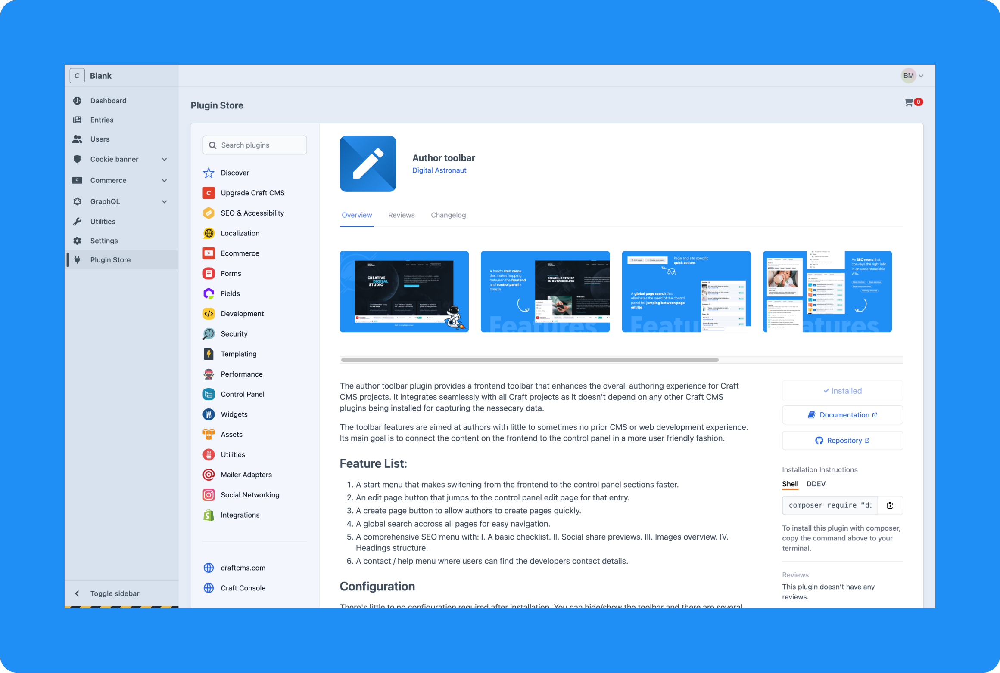

# Installation

## Composer

Install the latest version or a specific realese of the author toolbar via composer with the following console command

::: code-group

```bash[DDEV]
ddev composer install digitalastronaut/craft-author-toolbar
```

```bash[Other]
composer install digitalastronaut/craft-author-toolbar
```

:::

## Plugin store

Alternatively you can install the author toolbar plugin via the [craft plugin store](https://plugins.craftcms.com/author-toolbar?craft5).


